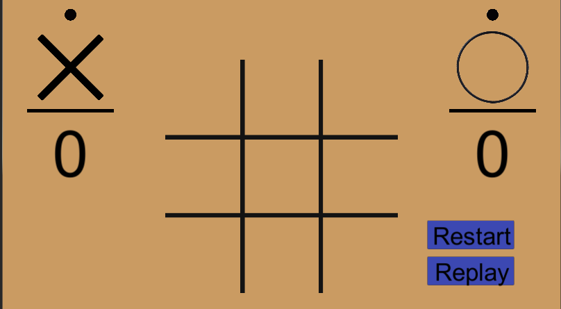
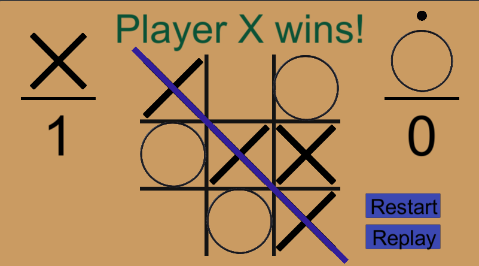

# Unity_Tictactoe

## About 
This is a simple turn-based Tic Tac Toe game built with Unity and written in C#. The game allows two players to take turns placing their makrs (X and O) on a 3x3 grid. The objective of the game is to get three marks of the same kind (horizontally, vertically, or diagonally) before the opponent does.
## 


## Features
* Two-player gameplay: Players take turns placing their marks on the grid
* Interactive UI: Clearn and intuitive user interface for a simple and engaing gameplay experience
* Win detection: The game automatically detects winning combinations and declares a winner.
* Draw detection: if all the cells are filled without any winner, then the game ends in a draw.

## Controls
To place a mark
```
Click or tap on an empty cell in the grid
```

## Installation

To run the game on your local machine, follow these steps:
```
1. Clone the repository or download the source code as a ZIP file.

2. Open Unity and navigate to the project folder.

3. Open the project in Unity by selecting the folder and clicking "Open."

4. Once the project is open, navigate to the "Scenes" folder and open the "Main" scene.

5. Connect a supported platform (such as your mobile device or Unity's Play Mode) to run the game.

6. Build and run the project.
```
